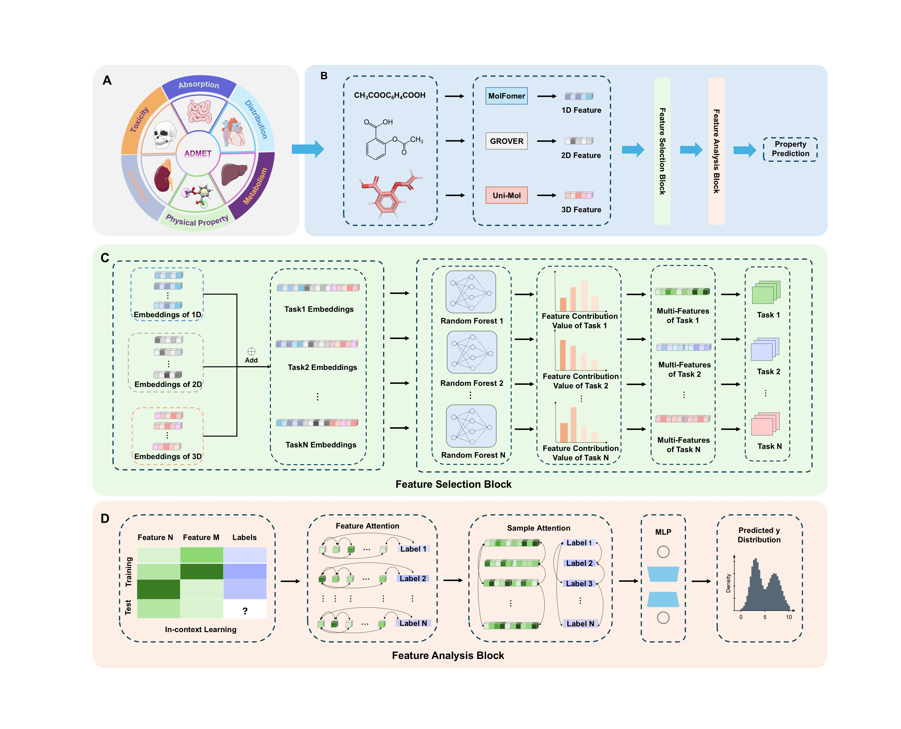

# DEAM: A Domain-Expert-Adaptive Multimodal Model for Enhancing ADMET Prediction

🎉 Our code is coming soon!

ADMET prediction is a pivotal aspect of drug development, influencing the success rate of over 50% in drug discovery initiative. With the rapid development of Deep Learning (DL), multimodal methods have demonstrated superior performance to single-modal methods, particularly in capturing structural information, due to their ability to integrate complementary data types. However, there still exist inevitable shortcomings, such as feature redundancy, high computational complexity, and limited interpretability. To address these limitations, we propose a Domain-Expert Adaptive Multimodal model, namely DEAM. The model leverages the decision-based Random Forests (RF) algorithm to eliminate feature redundancy and then incorporates bidirectional attention mechanism to assess the contribution of both features and samples, thereby reducing computational complexity. To evaluate the performance of DEAM, we have constructed a comprehensive ADMET database, encompassing 62 classification and 15 regression tasks. Extensive experiments demonstrate that DEAM outperforms ten baseline models, achieving an AUC of 84.5% (7.8% improvement) and an R-square of 71.2% (21.3% improvement). Furthermore, DEAM offers high adaptability, enabling domain experts to customize feature inputs, adjust feature dimensionality, and incorporate domain knowledge. This flexibility not only facilitates a deeper understanding of the model’s learning behavior but also empowers experts to further refine model performance through their specialized insights.

